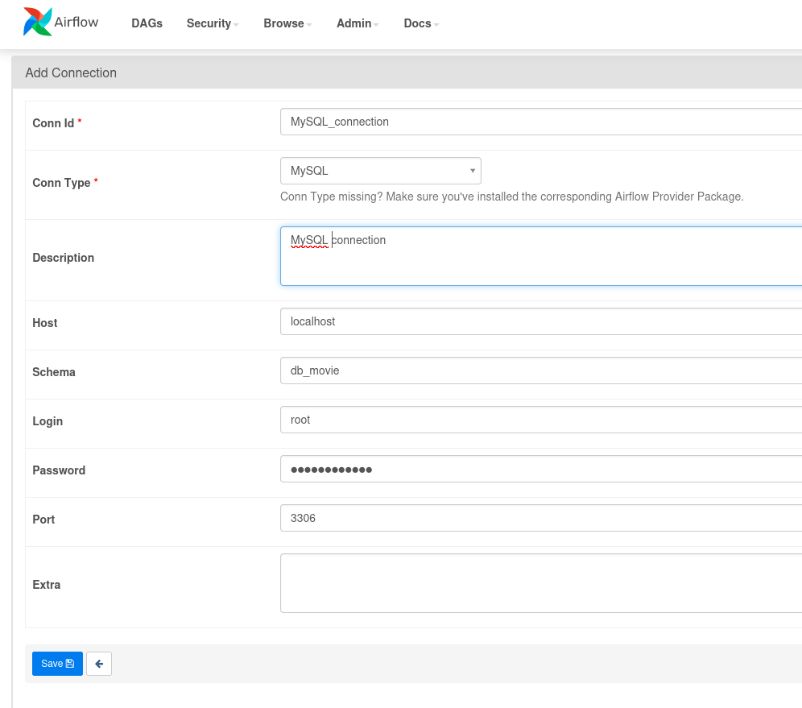

# Projet Movie-Recommandation


## What is Movie-Recommandation project ?

This project is realized in team during a MLOps training provided by [DataScientest](https://datascientest.com/).
The main goal is to deploy a solution using MLOps techniques we have learn.

The solution provide a list of 10 recommanded movies, based on one movie provided by the user.
Approach choosen by the team is content-based, so recommanded movies are choosen on similarites on a defined intrisec characteristic.
Similarity between movies are computed using a cosine similarity


## Architecture

The solution is contained in a Airflow docker-compose.
Airflow is used as a pipeline pre-processing, from download to data-base storage.
Data are hosted in a MySQL container.
A FastAPI container is containing cosine-similarity calculation, based on data retrieved from MySQL container.


## Data

- [https://www.imdb.com/interfaces/](https://www.imdb.com/interfaces/)

For this project, and due to limited computer ressources, we used the table contained in the file title.basics.tsv.gz

Our final table used for recommandation is the one below :
- tconst : movie id from IMDB
- titleType
- primaryTitle
- genres
- RuntimeCategory
- YearCategory 
- combined-features : this field concatenante several fields, and after a tokenization step, will become the vector for cosine-similarity computation


## How to install ?

#### Repository clone

``` 
git clone git@github.com:SarahSST/MLOPS-Movie-Recommandation.git
```

#### Linux packages

SQLAlchemy python package requires  mysqlclient and  mysql-connector-python packages, but both packages requires to be built, and requires some additionnales packages to be installed on linux

```
sudo apt update && apt upgrade
sudo apt install build-essential libssl-dev
sudo apt install python3-dev
sudo apt install default-libmysqlclient-dev

# if last package is not found, try this one : 
sudo apt install libmysqlclient-dev

# Package to be interact direclty with MySQL
sudo apt install mysql-client-core-8.0

# at last, some remaining packages
sudo apt install pip docker-compose
```

#### Python Packages

Python version used for this project is : 3.8.10

``` bash
pip install -r requirements.txt
```


#### Permission changes

```
sudo chmod -R 777 logs/ raw_data/ processed_data/ db_dump/ api_logs/
```

#### Airflow initialisation

Airflow requires an initialisation phase.

```
docker-compose up airflow-init
```

If everything went well, last line should display "mlops-movie-recommandation_airflow-init_1 exited with code 0"

#### Airflow start

Start of container in a detached mode
```
docker-compose up -d
```

#### SSH Tunnel initialisation

Airflow interface will be available on port 8080
FastAPI is available on port 8000
Streamlit App is available on port 8501

Tunnel SSH initialisation :
``` bash
ssh -i "your_key.pem" -L 8000:localhost:8000 -L 8080:localhost:8080 -L 8501:localhost:8501 ubuntu@your-ip-address

```

#### Airflow Connection

login: airflow
password: airflow

#### MySQL connection setup

Within the Airflow interface, a connection has to be created for MySQL.
In Admin menu, select Connection and fill fields as shown in the screen capture below.
MySQL password is : my-secret-pw



